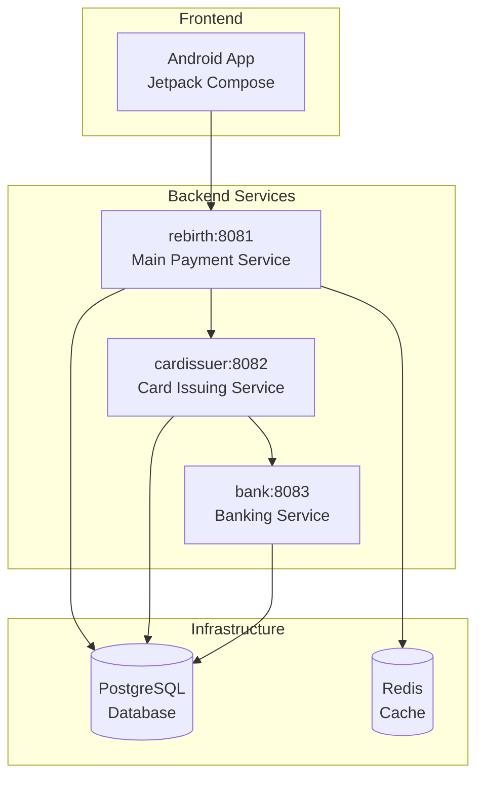

# Re:birth 🏦💳

> **스마트 카드 결제 및 혜택 추천 플랫폼**  
> 실시간 결제 처리, 카드 혜택 분석, 개인화된 카드 추천 서비스

[](https://openjdk.java.net/projects/jdk/17/)
[](https://spring.io/projects/spring-boot)
[](https://www.postgresql.org/)
[](https://redis.io/)
[](https://www.docker.com/)

## 📋 목차

- [프로젝트 개요](#-프로젝트-개요)
- [시스템 아키텍처](#-시스템-아키텍처)
- [핵심 기능](#-핵심-기능)
- [기술 스택](#-기술-스택)
- [보안 및 성능](#-보안-및-성능)
- [시작하기](#-시작하기)
- [API 문서](#-api-문서)
- [성능 지표](#-성능-지표)

## 🎯 프로젝트 개요

Re:birth는 **마이크로서비스 기반의 핀테크 결제 생태계**로, 완전한 카드 결제 시스템을 시뮬레이션합니다. 실시간 결제 처리, 스마트 카드 추천, 개인화된 혜택 분석을 통해 사용자에게 최적의 금융 서비스를 제공합니다.

### ✨ 주요 특징

- 🏛️ **마이크로서비스 아키텍처**: 독립적인 3개 백엔드 서비스
- 🔐 **엔터프라이즈급 보안**: JWT 인증, AES 암호화, HMAC 서명
- 📱 **모던 모바일 앱**: Jetpack Compose 기반 Android 애플리케이션
- ⚡ **실시간 처리**: SSE 기반 실시간 결제 알림
- 🤖 **AI 기반 추천**: 사용자 패턴 분석을 통한 카드 추천
- 📊 **데이터 분석**: 소비 패턴 분석 및 월별 리포트

## 🏗️ 시스템 아키텍처



### 서비스별 역할

| 서비스 | 포트 | 주요 기능 |
|--------|------|-----------|
| **rebirth** | 8081 | 결제 처리, 혜택 계산, 사용자 관리, AI 추천 |
| **cardissuer** | 8082 | 카드 발급, 거래 승인, 영구토큰 관리 |
| **bank** | 8083 | 계좌 관리, 잔액 처리, 거래 내역 |

## 🚀 핵심 기능

### 💳 스마트 결제 시스템
- **QR 코드 결제**: 암호화된 일회용 토큰 기반 결제
- **실시간 혜택 계산**: 결제 시점에 최적 카드 추천
- **다중 인증 방식**: 패턴/PIN/지문 인증 지원

### 🎯 개인화 서비스
- **AI 카드 추천**: 소비 패턴 기반 최적 카드 제안
- **혜택 분석**: 실시간 혜택 적용 및 누적 관리
- **소비 리포트**: 월별 소비 패턴 분석 및 시각화

### 📊 데이터 관리
- **마이데이터 연동**: 실시간 거래 내역 동기화
- **스케줄러**: 월별 거래 요약 자동 생성
- **캐싱**: Redis 기반 고성능 데이터 캐싱

## 🛠 기술 스택

### Backend
- **Framework**: Spring Boot 3.4.3, Spring Security
- **Language**: Java 17
- **Database**: PostgreSQL (JPA/Hibernate)
- **Cache**: Redis
- **Build Tool**: Gradle
- **Communication**: WebClient (Reactive)

### Frontend
- **Platform**: Android (Kotlin)
- **UI Framework**: Jetpack Compose
- **Architecture**: MVVM
- **Network**: Retrofit2, OkHttp3
- **Authentication**: Biometric, DataStore

### Infrastructure
- **Containerization**: Docker, Docker Compose
- **CI/CD**: Jenkins
- **Monitoring**: Spring Boot Actuator
- **Documentation**: Swagger/OpenAPI 3

## 🔐 보안 및 성능

### 보안 기능

#### 🛡️ 데이터 암호화
```java
// AES/CBC/PKCS5Padding 암호화
AES 256-bit 키 사용
HMAC-SHA256 데이터 무결성 검증
IV(Initialization Vector) 랜덤 생성
```

#### 🔒 인증/인가
- **JWT 기반 인증**: 7일 만료, HMAC-SHA 서명
- **다중 인증**: 패턴/PIN/생체 인증
- **토큰 기반 결제**: 5분 만료 일회용 토큰

#### 🏦 금융 보안
- **영구토큰**: 카드 정보 직접 저장 금지
- **비관적 락**: 계좌 잔액 동시성 제어
- **SMS 인증**: 회원가입 시 휴대폰 인증

### 성능 지표

| 항목 | 현재 성능 | 최적화 후 |
|------|-----------|-----------|
| **단일 결제 처리 시간** | 1.3-3.1초 | 0.8-1.2초 |
| **TPS (다중 계좌)** | 45 TPS | 500-1000 TPS |
| **동일 계좌 TPS** | 0.3 TPS | 90 TPS |
| **암호화 오버헤드** | ~10ms | ~5ms |

#### 🚀 성능 최적화 방안
1. **마이데이터 비동기 처리**: 40% 성능 향상
2. **낙관적 락 전환**: 동시성 300배 향상
3. **캐싱 레이어**: 혜택 계산 속도 10배 향상
4. **이벤트 기반 아키텍처**: 확장성 대폭 개선

## 🚀 시작하기

### 전제 조건
- Java 17+
- Docker & Docker Compose
- Android Studio (프론트엔드 개발)

### 1. 저장소 클론
```bash
git clone https://github.com/your-repo/rebirth.git
cd rebirth
```

### 2. 환경 변수 설정
```bash
# .env 파일 생성
cp .env.example .env

# 필수 환경 변수
POSTGRES_USER=rebirth_user
POSTGRES_PASSWORD=your_password
TOKEN_SECRET_KEY=your_secret_key
AES_KEY=your_aes_key
REDIS_URL=localhost
REDIS_PORT=6379
```

### 3. 인프라스트럭처 시작
```bash
# PostgreSQL & Redis 시작
docker-compose -f docker-compose.common.yml up -d
```

### 4. 백엔드 서비스 실행

#### 개발 환경 (개별 실행)
```bash
# rebirth 서비스
cd BE/rebirth
./gradlew bootRun

# cardissuer 서비스
cd BE/cardissuer
./gradlew bootRun

# bank 서비스
cd BE/bank
./gradlew bootRun
```

#### 프로덕션 환경 (Docker)
```bash
# 모든 서비스 빌드 및 실행
docker-compose -f docker-compose.app.yml up -d
```

### 5. Android 앱 실행
```bash
cd FE
./gradlew assembleDebug
# Android Studio에서 실행 또는
./gradlew installDebug
```

### 6. 서비스 확인
- **rebirth**: http://localhost:8081
- **cardissuer**: http://localhost:8082  
- **bank**: http://localhost:8083
- **API 문서**: http://localhost:8081/swagger-ui.html

## 📚 API 문서

각 서비스는 Swagger UI를 통해 API 문서를 제공합니다:

- **rebirth API**: http://localhost:8081/swagger-ui.html
- **cardissuer API**: http://localhost:8082/swagger-ui.html
- **bank API**: http://localhost:8083/swagger-ui.html

### 주요 API 엔드포인트

#### 인증 API
```http
POST /api/auth/signup      # 회원가입
POST /api/auth/login       # 로그인
POST /api/auth/sms         # SMS 인증
```

#### 결제 API
```http
POST /api/payment/online   # 온라인 결제
POST /api/payment/qr       # QR 결제
GET  /api/payment/benefit  # 혜택 조회
```

#### 카드 API
```http
GET  /api/cards           # 카드 목록
POST /api/cards/order     # 카드 신청
GET  /api/cards/recommend # 카드 추천
```

---

<div align="center">
  <strong>Re:birth</strong> - 혁신적인 핀테크 결제 플랫폼 🚀
</div>